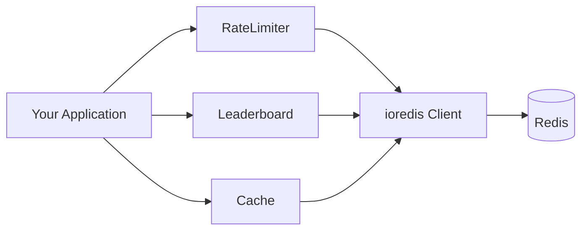

# upredis

Clean, domain-specific abstractions over Redis. Rate limiting, leaderboards, caching — with sane defaults, Lua-powered atomicity, and full TypeScript support.

[](https://www.npmjs.com/package/upredis)
[](./LICENSE)

```bash
npm install upredis ioredis
```

> **upredis** doesn't own your Redis connection. You create an [ioredis](https://github.com/redis/ioredis) client and pass it in — every abstraction is independently usable.

## Quick Start

```ts
import Redis from "ioredis";
import { RateLimiter, Leaderboard, Cache } from "upredis";

const redis = new Redis();

// Rate limit: 100 requests per 60s, sliding window
const limiter = new RateLimiter({
  redis,
  strategy: "sliding-window",
  limit: 100,
  window: 60,
});

const result = await limiter.limit("user:42");
if (!result.allowed) {
  console.log(`Retry after ${result.retryAfter}s`);
}

// Leaderboard: sorted rankings with O(log N) lookups
const lb = new Leaderboard({ redis, key: "weekly-scores" });

await lb.upsert("alice", 2850);
await lb.increment("alice", 150); // 3000
const top10 = await lb.top(10);

// Cache: cache-aside with stampede protection
const cache = new Cache<User>({ redis, defaultTTL: 300 });

const user = await cache.getOrSetSafe("user:42", async () => {
  return db.users.findById(42); // only one caller hits the DB
});
```

## Abstractions

| Abstraction | What it does | Docs |
|-------------|-------------|------|
| **RateLimiter** | Fixed window, sliding window, and token bucket rate limiting | [Guide](./docs/rate-limiter.md) |
| **Leaderboard** | Sorted-set-backed rankings with rank lookup, top-N, and neighborhood queries | [Guide](./docs/leaderboard.md) |
| **Cache** | Key-value cache with TTL, cache-aside, stampede protection, and batch ops | [Guide](./docs/cache.md) |

## Architecture



- **You own the connection** — pass an ioredis client, upredis never creates or closes connections
- **Key namespacing** — each abstraction prefixes its keys (`rl:`, `lb:`, `cache:`) to avoid collisions
- **Lua for atomicity** — multi-step operations use Lua scripts (not MULTI/EXEC) for correctness
- **No coupling** — each abstraction is independently importable and usable

## Development

```bash
# Start Redis
docker compose up -d

# Run tests
npm test

# Watch mode
npm run test:watch

# Type check
npm run typecheck

# Lint
npm run lint
```

Tests run against a real Redis instance (Docker on port 6380, DB 1). Each test gets a clean database via `FLUSHDB`.

```bash
# Use a custom Redis instance
REDIS_URL=redis://localhost:6379 npm test
```

## License

MIT
